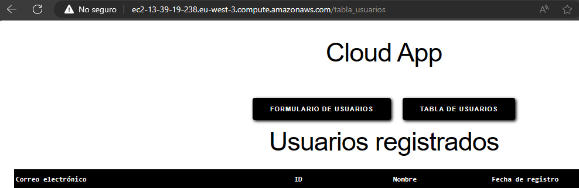

<!DOCTYPE html>
<html>

# Proyecto Cristian y Christian
## Objetivo:
 Crear una base de datos en DynamoDB que reciba "items" mediante una función Lambda, que a su vez la función Lambda coge los "items" desde un S3 bucket, introduciendo los datos a través de un formulario via web hospedado en una instancia de EC2, siendo el EC2 el encargado de mandar los documentos JSON al S3

# Índice:

<ol>
  <li><a href="#roles">Roles</a></li>
  <li><a href="#instancia">EC2</a></li>
  <li><a href="#s3">S3</a></li>
  <li><a href="#dynamodb">DynamoDB</a></li>
  <li><a href="#funcion">Lambda</a></li>
</ol>

<a id="roles"></a>

# Roles

Para trabajar con los siguientes servicios vamos a crear los roles en IAM y se los asignamos a los siguientes servicios para poder trabajar con ellos

#### Lambda
- Permisos de FullAccess sobre el servicio de DynamoDB y FullAccess sobre S3

#### EC2

- Permisos de FullAccess sobre S3 para mandar los documentos JSON al S3

La vista previa de los roles seria la siguiente:


<a id="instancia"></a>

# Creacion de EC2

En la creación de la instancia definimos el sistema operativo, en este caso elegimos Ubuntu, habilitamos HTTP y le asignamos el rol creado previamente en el apartado de "Advanced details" en la sección de "IAM instance profile" para tener permisos sobre S3


Una vez creada la instancia la actualizamos ("apt update" y "apt upgrade") y empezamos a instalar los siguientes paquetes que vamos a utilizar


- sudo apt install python3
- sudo apt install pip
   - sudo pip install flask
   - sudo pip install dash 
   - sudo pip install boto3
- sudo apt install json


Dentro de flask introducimos el documento encargado de recoger la información con la que vamos a trabajar posteriormente:


```python
import json
import boto3
import dash
from dash import dcc, html, dash_table
import random
import datetime

# Creamos una aplicación Dash
app = dash.Dash(__name__)

# Configuramos la conexión a la tabla de DynamoDB
dynamodb = boto3.resource('dynamodb', region_name='eu-west-3') #colocar la region que corresponde
tabla_usuarios = dynamodb.Table('formulario') #colocar nopmbre que le hayas puesto a la tabla

# Función para obtener los datos de la tabla de DynamoDB
def obtener_datos_dynamodb():
    response = tabla_usuarios.scan()
    items = response['Items']
    return items

# Definimos el estilo CSS para la página
external_stylesheets = ['https://codepen.io/chriddyp/pen/bWLwgP.css']
app = dash.Dash(__name__, external_stylesheets=external_stylesheets)

# Definimos el diseño general de la aplicación
app.layout = html.Div(style={'backgroundColor': 'white', 'padding': '20px', 'text-align': 
'center'}, children=[
    html.Div([
        html.H1('Cloud App', style={'color': 'black'}),
    ], style={'display': 'flex', 'align-items': 'center', 'justify-content': 'center', 
'margin-bottom': '20px'}),

    # Menú de navegación
    html.Div([
        dcc.Link(html.Button('Formulario de Usuarios', id='btn-formulario', n_clicks=0,
                             style={'background-color': 'black', 'color': 'white', 'border': 
'none', 'margin': '10px', 'box-shadow': '2px 2px 5px 0px #000000'}),
                 href='/formulario'),
        dcc.Link(html.Button('Tabla de Usuarios', id='btn-tabla-usuarios', n_clicks=0,
                             style={'background-color': 'black', 'color': 'white', 'border': 
'none', 'margin': '10px', 'box-shadow': '2px 2px 5px 0px #000000'}),
                 href='/tabla_usuarios'),
    ], style={'display': 'flex', 'justify-content': 'center'}),

    # Aquí se mostrará el contenido
    dcc.Location(id='url', refresh=False),
    html.Div(id='page-content'),
])

# Callback para cargar el contenido de las páginas
@app.callback(
    dash.dependencies.Output('page-content', 'children'),
    [dash.Input('url', 'pathname')]
)
def display_page(pathname):
    if pathname == '/formulario':
        # Si el usuario navega al formulario, muestra el contenido del formulario
        return html.Div([
            html.H1('Formulario de Usuarios', style={'color': 'black'}),
            dcc.Input(id='nombre', type='text', placeholder='Nombre', value='', 
style={'margin-bottom': '10px'}),
            dcc.Input(id='email', type='email', placeholder='Email', value='', 
style={'margin-bottom': '10px'}),
            html.Button('Enviar', id='submit-button', n_clicks=0,
                        style={'background-color': 'black', 'color': 'white', 'border': 'none', 
'box-shadow': '2px 2px 5px 0px #000000'}),
            html.Div(id='output-container-button', children='', style={'margin-top': '10px', 
'color': 'black'})
        ])
    elif pathname == '/tabla_usuarios':
        # Si el usuario navega a la tabla de usuarios, muestra el contenido de la tabla
        data = obtener_datos_dynamodb()
        return html.Div([
            html.H1('Usuarios registrados', style={'color': 'black'}),
            dash_table.DataTable(
                columns=[{'name': key, 'id': key} for key in data[0].keys()],
                data=data,
                style_table={'overflowX': 'auto', 'border': '1px solid black', 'backgroundColor': 
'white'},
                style_header={'backgroundColor': 'black', 'color': 'white', 'fontWeight': 'bold'},
                style_cell={'textAlign': 'left', 'border': '1px solid black'},
                style_data={'border': '1px solid black'},
                style_as_list_view=True
            )
        ])
# Ruta para manejar la subida de datos del formulario
@app.callback(
    dash.dependencies.Output('output-container-button', 'children'),
    [dash.Input('submit-button', 'n_clicks'),
     dash.State('nombre', 'value'),
     dash.State('email', 'value')]
)
def submit_form(n_clicks, nombre, email):
    # Obtenemos los datos del formulario
    usuario = {
        'ID': random.randint(100000, 999999),
        'Nombre': nombre,
        'Correo electrónico': email,
        'Fecha de registro': datetime.date.today().strftime('%Y-%m-%d')
    }
    tabla_usuarios.put_item(Item=usuario)
    return f'Se ha enviado el formulario: {nombre}, {email}'

if __name__ == '__main__':
    app.run_server(host='0.0.0.0', port=80, debug=True)
```
Su vista previa seria la siguiente:

### Menú

### Formulario

### Tabla de datos


En el momento en el que se rellena el formulario se genera un documento JSON que enviamos al bucket S3


<a id="s3"></a>

# Creación del Bucket S3

En la creación del bucket le definimos le nombre, le asignamos la región correspondiente, desabilitamos la ACL y permitimos el acceso público

<a id="dynamodb"></a>

# Creación de la base de datos en DynamoDB

Accedemos al apartado de "Tables" y empezamos la creación de la tabla

Le asignamos el nombre de "formulario"
En "partition key" le asignamos la clave ID de tipo "number"


En "table settings" definimos esta politica como "Default settings" y procedemos a crear la tabla

Una vez creada la tabla y estando localizados dentro de la tabla accedemos a "Exports and streams" y en "DynamoDB stream details" habilitamos esta opción para posteriomente recibir un refresco constante de la tabla de cara a la pagina web


<a id="funcion"></a>

# Creacion de la función Lambda

Accedemos a "Create funcion" y empezamos

Le asignamos nombre a la función
En "runtime" definimos el lenguaje como "Python 3.11" 
En "Permissions" le damos a la opción de "Use an existing role" y elegimos el rol que hemos definido previamente con FullAccess sobre DynamoDB y S3

Una vez creada la función accedemos a ella y definimos el "trigger" sobre S3, al seleccionar S3 elegimos el cubo creado previamente

En "Event types" selecionamos "All object create events" y en el apartado de "Suffix" escribimos ".json" para trabajar unicamente con los documentos con esa extensión 

Definiendo este "trigger" con esta configuración lo que conseguimos es que cada vez que entre un nuevo archivo.json al bucket se va a iniciar la función lambda

Después de definir el "trigger" accedemos al apartado de "code" dentro de la función y configuramos el codigo que queremos que ejecute

```python

import boto3
import json

s3_client = boto3.client('s3')
dynamodb = boto3.resource('dynamodb')

def lambda_handler(event, context):
    
    print(event)

    bucket = event['Records'][0]['s3']['bucket']['name']
    
    print("Encontramos el nombre del cubo")
    
    json_file_name = event['Records'][0]['s3']['object']['key']
    
    print("Encontramos la llave")
    
    json_object = s3_client.get_object(Bucket=bucket,Key=json_file_name)
    
    print("Encontramos el fichero")
    
    jsonFileReader = json_object['Body'].read().decode('utf')
    jsonDict = json.loads(jsonFileReader)

    table = dynamodb.Table('formulario')
    table.put_item(Item=jsonDict)

    print("metemos el fichero a la tabla")

    return 'Hello from Lambda'

```

En el servicio de CloudWatch se van a ir generando "logs" relacionados con la función lambda cada vez que se ejecute, de esta manera podemos hacer pruebas con la función lamda y hacer control de errores


Cuando la función Lambda se ejecuta, la función se encarga de coger los documentos .json nuevos que entren al bucket, de ellos extrae la "key" y la introduce en la tabla junto con sus otros campos, la vista previa en la base de datos seria la siguiente:


Dando como resultado estos campos en la tabla de la pagina web

